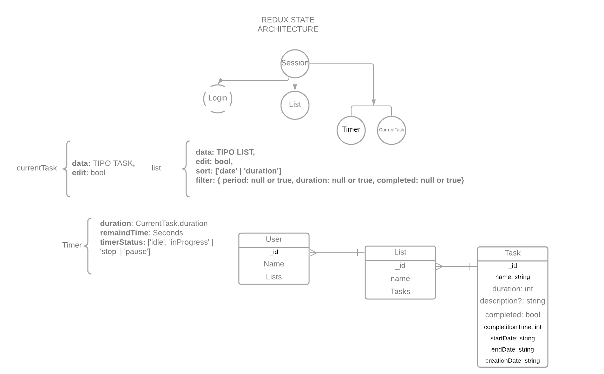

# Productive list

Devacran Productive List - Sometimes our stop-doing list needs to be bigger than our to-do list.

**Site:** [http://productive-list-app.vercel.app/](http://productive-list-app.vercel.app/)

.gif>)

# Table of content

# ☄Getting Started

To run this project locally:

**Linux & npm**

Clone this repo `$ git clone https://github.com/devacran/productive-list-app`

Frontend

1. Enter to the folder `$ cd ./productive-list-app`
2. Install dependencies `$ npm i`
3. Run development enviroment`$ npm run start`

# State Architecture

## Actions

- **setCurrentTask**

  Set in the local state of the application, the task that is currently selected.

- **updateCurrentTaskData**

  Updates the information for the task that is currently selected.

- **updateTaskDataFromList**

  Updates the information for the task that is currently selected in the list. ID is required.

- **setNewTaskToList**

  Add a new task to the list

- **setListData**

  Set in the local state of the application, the list data.

- **removeTaskFromList**

  Removes a task from the list. ID is required.

- **setListSortType**

  Set the order of the list. Types available: "date" or "duration"

- **setListFilters**

  Set the filters of the list. Filters available: { period: null or true, duration: null or true, completed: null or true}

- **setTaskTimer**

  Set in the local state of the application, the timer data from the current task.

- **setTimerRemind**

  Set in the local state of the application the time remaining to mark the task completed.

- **setTimerStatus**

  Set in the local state of the application the timer status. Status available: "idle", "stop", "inProgress", "pause"

## Reducers

- **currentTaskReducer**
- **listReducer**
- **timerReducer**

# 🐬Deployment

This project has deployed with Vercel

# 📰 License

The MIT Licence (MIT)

# 👨‍🍳Contributing

If you want to contribute with this project, just make a Pull Request explaining the improving.

# 🖥 Technologies

Frontend

- React JS
- React Material
- Sass
- Chart JS
- Webpack
- Babel
